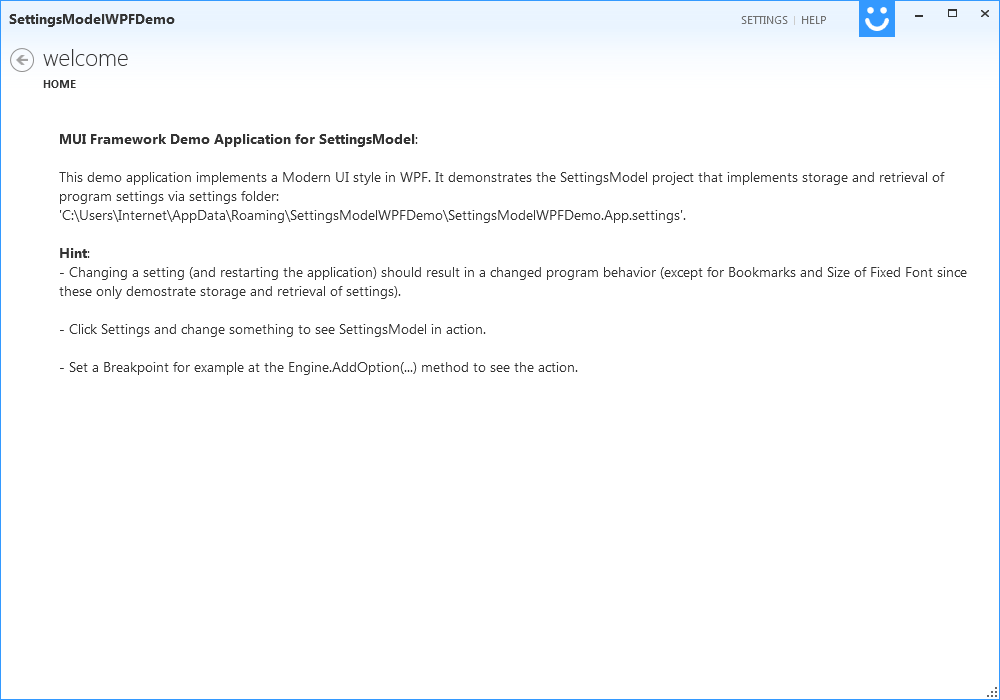
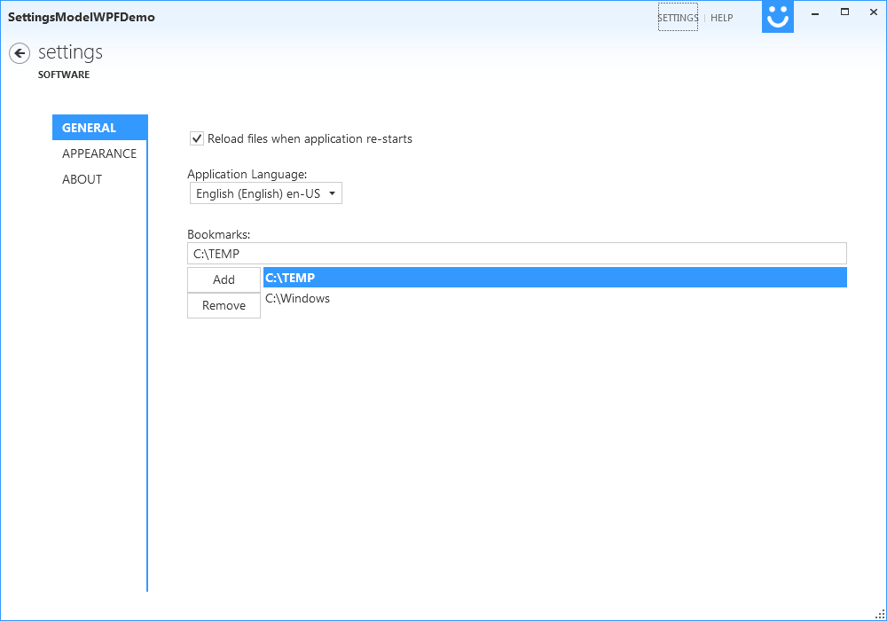
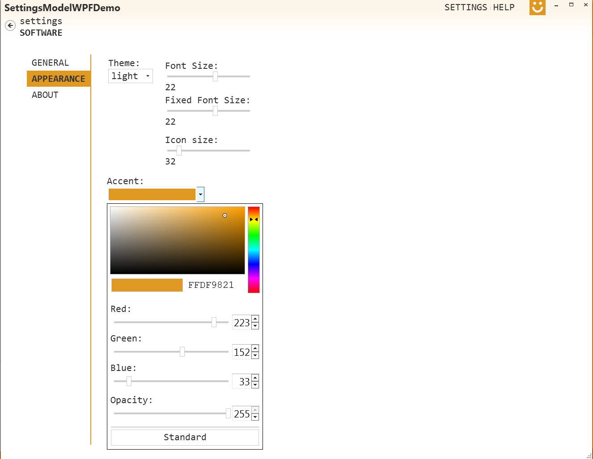
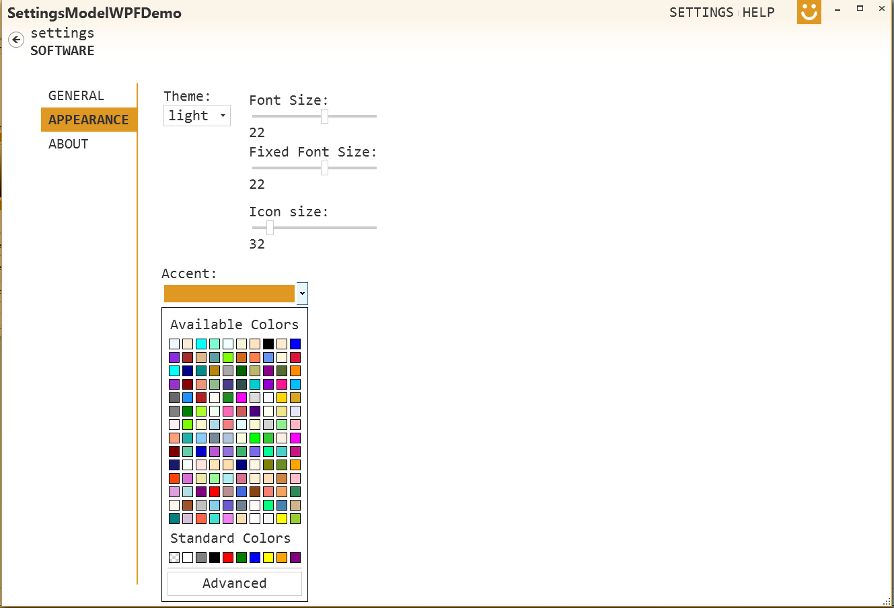
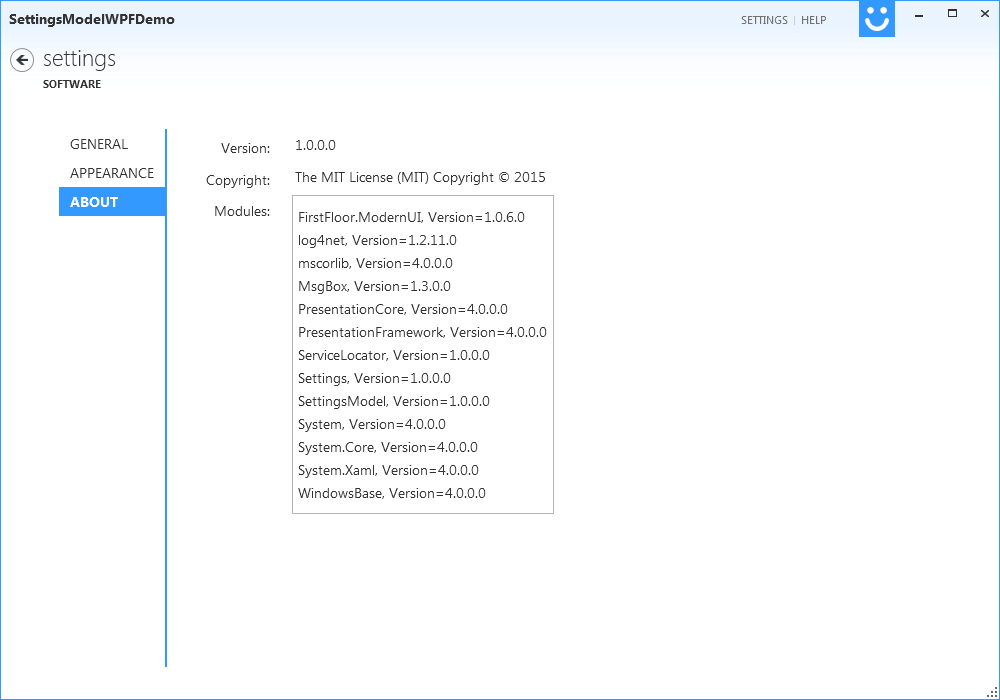
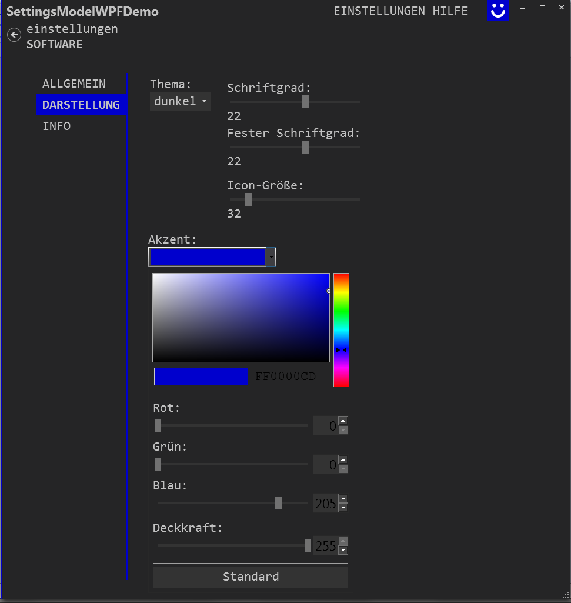
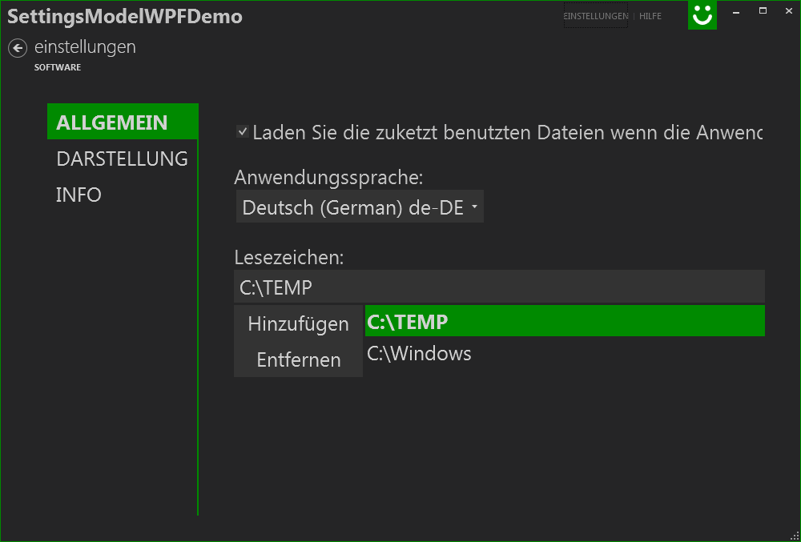

# SettingsModelWPFDemo

The WPF demo application can be used to demonstrate storage and retrieval of more complex values like color or font size settings. Always remember to leave the Settings section before exiting the application in order to restore last edits in the settings section(!).

The initial window looks like this. The defaults are Light Theme and English:

The settings show some values that can be changed. All values that can be changed here are stored and retrieved on application re-start but not all values are actually influencing the demo application.

The settings:
* Reload files on application re-start
* Fixed Font Size
* Bookmark
* Icon Size

are only stored and retrieved but are otherwise ignored in the demo application. I needed these items here since I want to use them in future application but did not want to make this demo too complex by adding more slightly unrelated features.

The Appearance page can be used to change the look and feel of the demo application.

The About page shows basic information about this application.

This screenshot was generated after changing the UI Language to German, changing some Appearance settings, exciting the Settings section via the Left arrow back button, and re-starting the application.

A screenshot of the General page with dark theme and German localization

