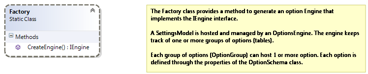
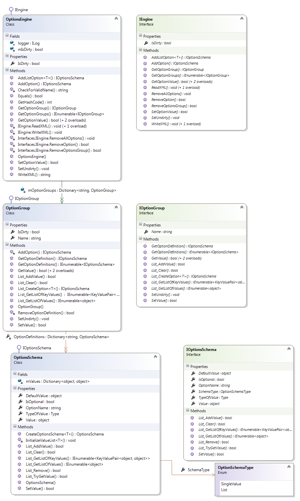
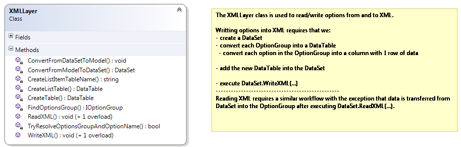

# Technical Documentation

The documentation listed in this page refers to the **SettingsModel** library project which is the project that implements the model of the settings engine and takes care of storage and retrieval to and from persistence.

## Factory

[https://settingsmodel.codeplex.com/SourceControl/latest#1.0/SettingsModel/Models/Factory.cs](https://settingsmodel.codeplex.com/SourceControl/latest#1.0/SettingsModel/Models/Factory.cs) 

## API

The below graphic shows that a **SettingsModel** is really a dictionary of **OptionGroup**s where each **OptionGroup** contains a dictionary of **OptionSchema**s:

* see **OptionsEngine.mOptionsGroup** and **OptionGroup.OptionsDefinitions**

[http://settingsmodel.codeplex.com/SourceControl/latest#1.0/SettingsModel/Interfaces/IEngine.cs](http://settingsmodel.codeplex.com/SourceControl/latest#1.0/SettingsModel/Interfaces/IEngine.cs)
[http://settingsmodel.codeplex.com/SourceControl/latest#1.0/SettingsModel/Interfaces/IOptionGroup.cs](http://settingsmodel.codeplex.com/SourceControl/latest#1.0/SettingsModel/Interfaces/IOptionGroup.cs)
[http://settingsmodel.codeplex.com/SourceControl/latest#1.0/SettingsModel/Interfaces/IOptionsSchema.cs](http://settingsmodel.codeplex.com/SourceControl/latest#1.0/SettingsModel/Interfaces/IOptionsSchema.cs)

The items on the right side of the graphic show the interface definition of each class. This is the API that consuming applications use to implement their customized SettingsModel. 

## XML Layer

The XML Layer class is currently invisible to the outside world but is listed here for the sake of completeness.

[http://settingsmodel.codeplex.com/SourceControl/latest#1.0/SettingsModel/Models/XML/XMLLayer.cs](http://settingsmodel.codeplex.com/SourceControl/latest#1.0/SettingsModel/Models/XML/XMLLayer.cs)
